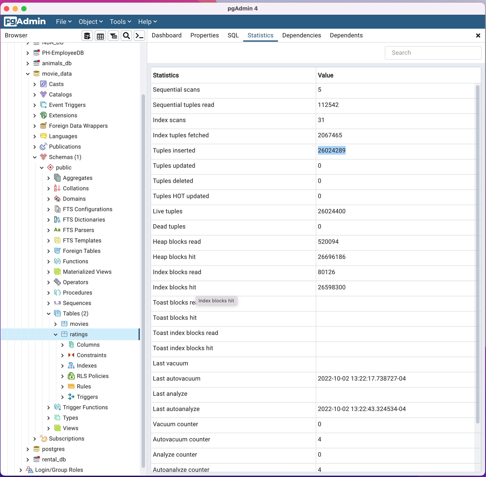

# Movies ETL

The purpose of this project was to learn and then practice methods to extract, transform, and load data from sources like CSV files or JSON files to a database like postgresSQL to allow additional analysis to be completed.

In this repository the `ETL_create_database.ipynb` file contains the final work product to extract three source files about movies, cleanse them, and create two output databases. The final databases, movies and ratings, have 6,052 and 26,024,289 rows of data, respectively.

This image shows the results of a query to count the rows of the movies table in pgAdmin:

Creating the same query on the ratings table generated an error that I have not yet figure out how to resolve:

However, using this screen I am able to show that all data was successfully inserted into the table:

